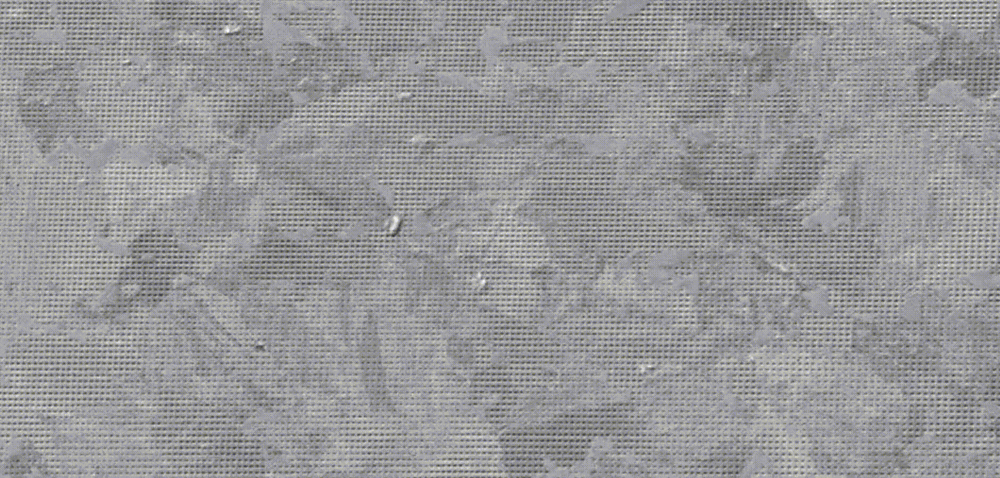

# Nano-hardness maps on complex-phase steel with high spatial accuracy

This repository contains the nano-hardness map of a commercial steel grade, cold-rolled CP600, superimposed on various SEM images taken from the same region on the specimen surface.

The following animation shows an SE image, onto which the indentation points with hardness-coded color are superimposed:

This [video](./EBSD-IPF_EBSD-BS_Hardness.mp4?raw=True) contains a slide-show of two EBSD image (with IPF color code and band-slope color code) followed by the hardness map on the identical region.
